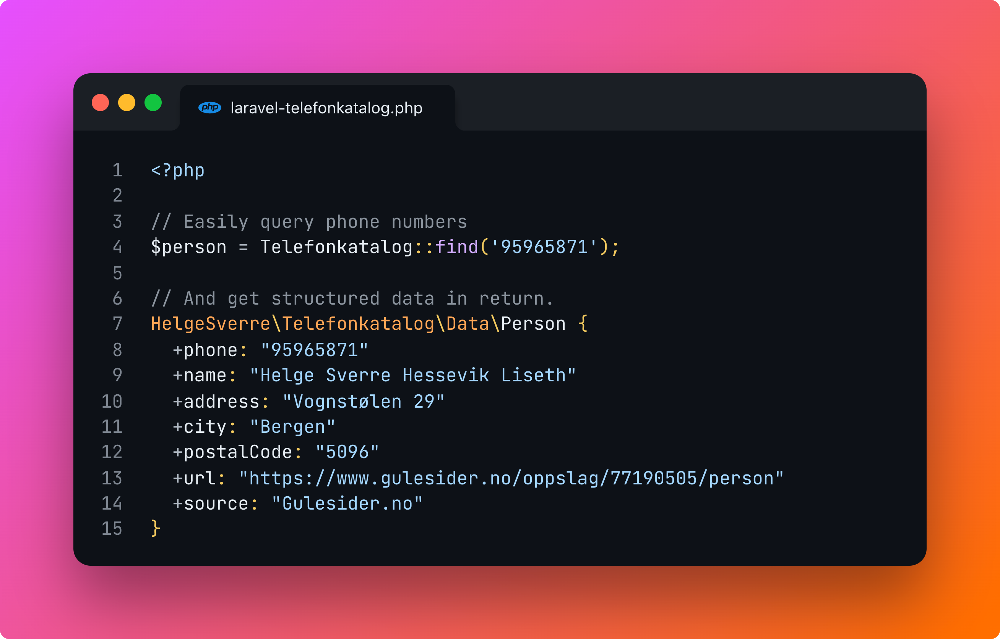

<p align="center"></p>

# Laravel Telefonkatalog: A Package for Norwegian Phone Directory Data Retrieval


## Overview

Laravel Telefonkatalog is a package designed for scraping data from phone directories. It returns the extracted data as
a list of `Person` objects, making it easier for developers to integrate phone number information into their
applications.

This package is specifically tailored for Norwegian developers looking to incorporate auto-fill functionality into forms
on a small scale.

### Important Note

This package is not designed for large-scale phone number scraping, as it does not provide any protection or bypass
against captchas, anti-botting software, IP-blocking, or rate-limiting. It is exclusively intended for low-traffic web
apps requiring occasional auto-fill features in customer/user forms.

## Supported Phone Directories

This package currently scrapes data from these phone directories:

- [1881.no](https://1881.no)
- [1890.no](https://1890.no)
- [Gulesider.no](https://gulesider.no)

## Installation

Install the package via Composer:

```bash
composer require helgesverre/laravel-telefonkatalog
```

## Usage

Import the facade, and call the method, no need to make things complicated.

```php
use HelgeSverre\Telefonkatalog\Facades\Telefonkatalog;

// Search by name across all data sources
$people = Telefonkatalog::search('helge sverre');

// Find the first result matching a phone number
$person = Telefonkatalog::find('95965871');
```

### Return value.

- `find("number or name")` returns a single  `Person` object.
- `search("number or name")` returns many `Person` objects as a laravel collection.

### Example:

```php
HelgeSverre\Telefonkatalog\Data\Person {
  +phone: "95965871"
  +name: "Helge Sverre Hessevik Liseth"
  +address: "Vognstølen 29"
  +city: "Bergen"
  +postalCode: "5096"
  +url: "https://www.gulesider.no/oppslag/77190505/person"
  +source: "Gulesider.no"
}
```

## License

The MIT License (MIT). Please see [License File](LICENSE.md) for more information.
